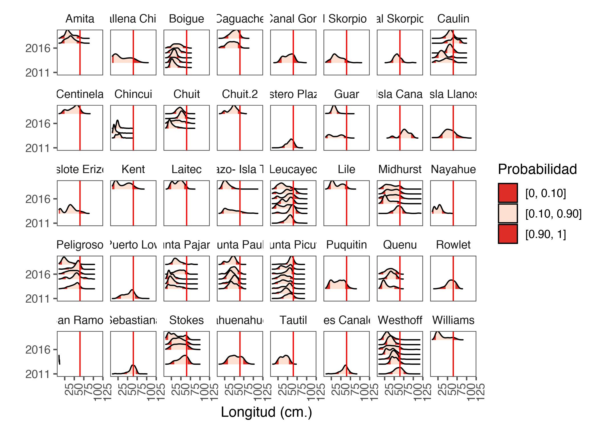
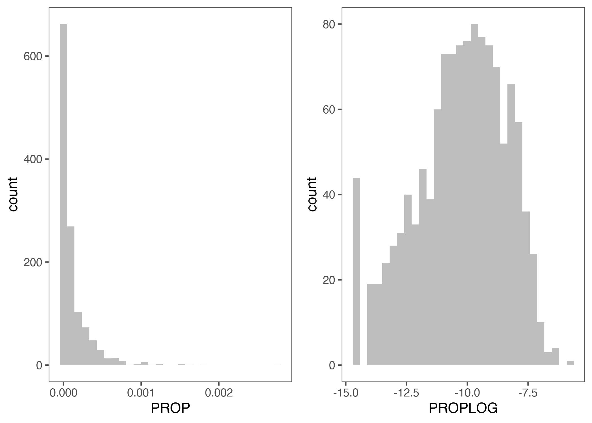
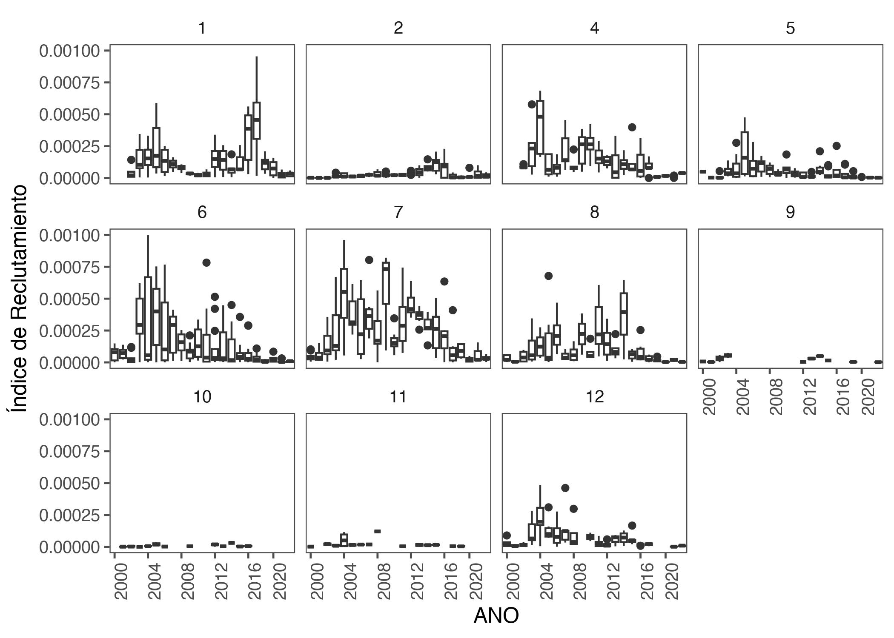
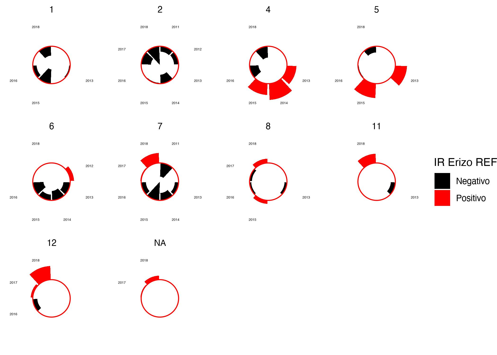

# Contexto

Este análisis tiene como objetivo calcular un índice de reclutamiento (IR) del recurso *Loxechinus albus* a través de los datos monitoreados, ya sea por la flota pesquera, asó como también desde el muestreo poblacional que lleva a cabo el proyecto Red de Estaciones Fijas (REF).

# Metodología

Los pasos para calcular el indice son los siguentes:

- Identificar cuantiles superior e inferior (10% y 90%) de la estructura de tallas de la REF y monitoreo.

- Calcular el cuantíl 90% de la REF como proporción de individuos que ingresan a la pesquería. 

- Con este valor del 90%, se calculan los individuos ajo esta talla provenientes de la pesquería. Luego se calcula la cantidad de inviduos bajo esa talla agrupados por distintas variables como `ANO_ARR`, `MES_ARR`, `POLIGONO`, `POLIGONO_IFOP`, `ZONA`.

- Se calcula la proporción respecoal total. Se identifica la distribución de los datos, luego se normalizan para que los datos tengan una distribución normal, y posteriormente,  se estandarizan para llevarlos a un indice e tre -1 y 1, lo cual indica reclutamientos negativos y positivos respectivamente.

- Despliegue en diferentes plot y agrupaciones temporales y espaciales.

- Para los datos del REF, se reite el proceso descrito anteriormente, pero se establece la media (10%) como limite de referencia para el reclutamiento

# Set de trabajo y librerías utilizadas


```r
rm(list = ls())
knitr::opts_chunk$set(message = FALSE,
                      warning = FALSE,
                      fig.align = 'center',
                      fig.pos = "H",
                      dev = 'jpeg',
                      dpi = 300,
                      fig.path="Figuras/")
#XQuartz is a mess, put this in your onload to default to cairo instead
options(bitmapType = "cairo") 
# (https://github.com/tidyverse/ggplot2/issues/2655)
# Lo mapas se hacen mas rapido
```


```r
options(bitmapType = "cairo") 
#XQuartz is a mess, put this in your onload to default to cairo instead (https://github.com/tidyverse/ggplot2/issues/2655)
# Lo mapas se hacen mas rapido
# solo para IOs
```


```r
library(GGally)
library(knitr)
library(tidyverse)
library(patchwork)
library(marmap)
library(mapproj)
library(maps)
library(raster)
library(knitr)
library(ggrepel)
library(sf)
library(ggthemes) # nuevos fondos
library(readxl)
library(performance)
library(ggridges)
library(see)
library(egg)
```


```r
here::here()
```

```
## [1] "/Users/mauriciomardones/IFOP/Erizo_SA/2024/Data/recruit_seaurchin_Chile"
```

# Leo datos Tallas estaciones fijas


```r
EstFij <- read_csv2("Talla_EstFi_20011_2018.csv")
EstFij2 <- as.data.frame(EstFij)
```

Estos datos tienen las siguientes variables


```r
names(EstFij2)
```

```
## [1] "year"      "fecha"     "macrozona" "poligono"  "sector"    "talla_mm"
```


## Exploración primaria


```r
jz3 <- ggplot(EstFij2 %>% 
                drop_na(), aes(x=talla_mm, y = as.factor(year), 
                      fill = factor(stat(quantile))))+
  stat_density_ridges(
    geom = "density_ridges_gradient",
    calc_ecdf = TRUE,
     quantiles = c(0.10, 0.90)) +
  scale_fill_manual(
    name = "Probabilidad", values = c("#de2d26", "#fee0d2", "#de2d26"),
    labels = c("[0, 0.10]", "[0.10, 0.90]", "[0.90, 1]"))+
  facet_wrap(.~sector, ncol=8) +   
  geom_vline(xintercept = 65, color = "red")+
  scale_x_continuous(breaks = seq(from = 40, to = 120, by = 10))+
  scale_y_discrete(breaks = seq(from = 1996, to = 2022, by = 5))+
  #scale_fill_viridis_d(name="SubArea")+
  theme_few()+
  theme(axis.text.x = element_text(angle = 90, hjust = 1))+
  xlim(10,120)+
  xlab("Longitud (cm.)")+
  ylab("")
jz3
```


Lo mismo por poligono


```r
jz4 <- ggplot(EstFij2 %>% 
                drop_na(), aes(x=talla_mm, y = as.factor(year), 
                      fill = factor(stat(quantile))))+
  stat_density_ridges(
    geom = "density_ridges_gradient",
    calc_ecdf = TRUE,
    quantiles = c(0.10, 0.90),
    jittered_points = TRUE,
    alpha=0.1) +
  scale_fill_manual(
    name = "Probabilidad", values = c("#de2d26", "#fee0d2", "#de2d26"),
    labels = c("[0, 0.10]", "[0.10, 0.90]", "[0.90, 1]"))+
  facet_wrap(.~poligono, ncol=5) +   
  geom_vline(xintercept = 65, color = "red")+
  scale_x_continuous(breaks = seq(from = 40, to = 120, by = 10))+
  scale_y_discrete(breaks = seq(from = 1996, to = 2022, by = 5))+
  #scale_fill_viridis_d(name="SubArea")+
  theme_few()+
  theme(axis.text.x = element_text(angle = 90, hjust = 1))+
  xlim(10,120)+
  xlab("Longitud (cm.)")+
  ylab("")
jz4
```


Lo mismo por zona
geom_density_ridges(stat = "binline", bins = 50, 
                      scale = 1.8, 
                      draw_baseline = FALSE,
                      alpha=0.8)+

```r
jz5 <- ggplot(EstFij2 %>% 
                drop_na(), aes(x=talla_mm, y = as.factor(year), 
                      fill = factor(stat(quantile))))+
  stat_density_ridges(
    geom = "density_ridges_gradient",
    calc_ecdf = TRUE,
    quantiles = c(0.10, 0.90),
    jittered_points = TRUE,
    alpha=0.1,
    rel_min_height = 0.05) +
  scale_fill_manual(
    name = "Probabilidad", values = c("#de2d26", "#fee0d2", "#de2d26"),
    labels = c("[0, 0.10]", "[0.10, 0.90]", "[0.90, 1]"))+
  facet_wrap(.~macrozona, ncol=3) +   
  geom_vline(xintercept = 65, color = "red")+
  scale_x_continuous(breaks = seq(from = 40, to = 120, by = 10))+
  scale_y_discrete(breaks = seq(from = 1996, to = 2022, by = 1))+
  #scale_fill_viridis_d(name="SubArea")+
  theme_few()+
  theme(axis.text.x = element_text(angle = 90, hjust = 1))+
  xlim(10,120)+
  xlab("Longitud (cm.)")+
  ylab("")
jz5
```


Ahora Calculo cuantiles por grupo


```r
# Calcular cuantiles por grupo
cuantiles_por_zona <- tapply(EstFij2$talla_mm, 
                              EstFij2$macrozona,
                              function(x) quantile(x, c(0.10, 0.5, 0.90)))
cuantiles_por_poligono <- tapply(EstFij2$talla_mm, 
                              EstFij2$poligono,
                              function(x) quantile(x, c(0.10, 0.5, 0.90)))
cuantiles_por_año <- tapply(EstFij2$talla_mm, 
                              EstFij2$year,
                              function(x) quantile(x, c(0.10, 0.5, 0.90)))

print(cuantiles_por_zona)
```

```
## $`X Norte`
## 10% 50% 90% 
##  22  45  63 
## 
## $`X Sur`
## 10% 50% 90% 
##  21  38  57 
## 
## $XI
## 10% 50% 90% 
##  23  46  66
```

```r
print(cuantiles_por_poligono)
```

```
## $`1`
## 10% 50% 90% 
##  20  34  53 
## 
## $`2`
## 10% 50% 90% 
##  33  55  66 
## 
## $`4`
##  10%  50%  90% 
## 16.0 28.5 54.0 
## 
## $`5`
## 10% 50% 90% 
##  18  38  57 
## 
## $`6`
## 10% 50% 90% 
##  24  39  57 
## 
## $`7`
## 10% 50% 90% 
##  26  50  67 
## 
## $`8`
## 10% 50% 90% 
##  24  41  63 
## 
## $`11`
##  10%  50%  90% 
## 21.0 32.0 62.4 
## 
## $`12`
## 10% 50% 90% 
##  19  39  65
```

```r
print(cuantiles_por_año)
```

```
## $`2011`
## 10% 50% 90% 
##  41  58  70 
## 
## $`2012`
## 10% 50% 90% 
##  23  32  51 
## 
## $`2013`
## 10% 50% 90% 
##  20  41  63 
## 
## $`2014`
## 10% 50% 90% 
##  15  31  57 
## 
## $`2015`
## 10% 50% 90% 
##  19  33  55 
## 
## $`2016`
## 10% 50% 90% 
##  24  46  63 
## 
## $`2017`
## 10% 50% 90% 
##  28  45  63 
## 
## $`2018`
## 10% 50% 90% 
##  22  40  61
```


Una vez definidos los quantiles de los muestreos poblacionales (Estaciones Fijas), se identifica que valores de entre `54 y 46 mm ` son identificados como un porcentaje de ingreso a la fraccion eplotable. 

Calculo el promedio del cuantil `90` por zona.


```r
mean(54, 38, 46)
```

```
## [1] 54
```

# Calculo Indice Reclutamiento

## Tallas Seguimiento


```r
load("talla2022.Rdata")
```


```r
talla2022exp <- talla2022 %>% 
  drop_na() %>% 
  type.convert(as.is = TRUE) %>% 
  uncount(FRECUENCIA)

colSums(is.na(talla2022exp))
```

```
##        PROCED      POLIGONO POLIGONO_IFOP             X        REGION 
##             0             0             0             0             0 
##        PUERTO       ANO_ARR       MES_ARR       DIA_ARR       FUNCION 
##             0             0             0             0             0 
##       CAPTURA       DESTINO        PESO_M      LONGITUD          ZONA 
##             0             0             0             0             0
```


```r
tallasegpo <- ggplot(talla2022exp %>% 
                drop_na(), aes(x=LONGITUD, y = as.factor(ANO_ARR), 
                      fill = factor(stat(quantile))))+
  stat_density_ridges(
    geom = "density_ridges_gradient",
    calc_ecdf = TRUE,
     quantiles = c(0.10, 0.90)) +
  scale_fill_manual(
    name = "Probabilidad", values = c("#3182bd", "#deebf7", "#3182bd"),
    labels = c("[0, 0.10]", "[0.10, 0.90]", "[0.90, 1]"))+
  facet_wrap(.~POLIGONO, ncol=6) +   
  geom_vline(xintercept = 65, color = "red")+
  scale_x_continuous(breaks = seq(from = 40, to = 120, by = 10))+
  scale_y_discrete(breaks = seq(from = 1996, to = 2022, by = 5))+
  #scale_fill_viridis_d(name="SubArea")+
  theme_few()+
  theme(axis.text.x = element_text(angle = 90, hjust = 1))+
  xlim(10,120)+
  xlab("Longitud (cm.)")+
  ylab("")
tallasegpo
```


El promedio de un 10% de los quantiles de entrada a la fracción explotable es de `56 mm`.

Ahora identifico los distintos cuantiles de los datos de pesquería y estaciones


```r
cuantil_10pesq <- quantile(talla2022exp$LONGITUD, 0.10)
cuantil_10est <- quantile(EstFij2$talla_mm, 0.90)
```

Calculo el indice

```r
indice_reclutamiento <- talla2022exp %>%
  filter(LONGITUD<cuantil_10est) %>% 
  group_by(ANO_ARR, MES_ARR, POLIGONO, ZONA, POLIGONO_IFOP) %>%
  summarize(PROP = n() / nrow(talla2022exp)) %>% 
  mutate(PROPLOG =log(PROP))
# Crear gráficos en facet_wrap de barras para representar el índice de reclutamiento
```

ahora estandarizo los datos entre -1 y 1.


```r
a <- -1  # Límite inferior del rango objetivo
b <- 1   # Límite superior del rango objetivo

# Calcular el valor mínimo y máximo de tus datos
min_x <- min(indice_reclutamiento$PROPLOG)
max_x <- max(indice_reclutamiento$PROPLOG)

# Aplicar la fórmula de normalización
indice_reclutamiento$PROPLOG2 <- ((indice_reclutamiento$PROPLOG- min_x) / (max_x - min_x)) * (b - a) + a
```


veo la distribucion de las variables


```r
nor <- ggplot(indice_reclutamiento, aes(PROP)) + 
  geom_histogram(fill="grey")+
  theme_few()
log <- ggplot(indice_reclutamiento, aes(PROPLOG)) + 
  geom_histogram(fill="grey")+
  theme_few()

ggarrange(nor, log, ncol = 2)
```




Veo los datos crudos  con la linea como media del cuantil de los datos

```r
indseg <- ggplot(indice_reclutamiento , 
       aes(x = factor(ANO_ARR), 
           y = PROP)) +
  geom_boxplot() +
  facet_wrap(POLIGONO~., ncol=4) +
  scale_x_discrete(breaks = seq(from = 1996, to = 2022, by = 4))+
  theme_few()+
    theme(axis.text.x = element_text(angle = 90, hjust = 1))+
   labs(x = "ANO", 
        y = "Índice de Reclutamiento")+
  ylim(0, 0.001)
indseg
```



Veo los datos normalizados con la linea como media del cuantil de los datos

```r
indseg2 <- ggplot(indice_reclutamiento , 
       aes(x = factor(ANO_ARR), 
           y = PROPLOG)) +
  geom_boxplot() +
  facet_wrap(POLIGONO~., ncol=4) +
  geom_hline(yintercept = quantile(indice_reclutamiento$PROPLOG, 0.5), 
             color = "blue")+
  scale_x_discrete(breaks = seq(from = 1996, to = 2022, by = 4))+
  theme_few()+
  theme(axis.text.x = element_text(angle = 90, hjust = 1))+
   labs(x = "ANO", 
        y = "Índice de Reclutamiento")
indseg2
```


```r
indseg3 <- ggplot(indice_reclutamiento  %>% 
  group_by(ANO_ARR,POLIGONO) %>%
  summarise(PROPLOG3=mean(PROPLOG2)), 
       aes(x = factor(ANO_ARR), 
           y = PROPLOG3,
           fill=PROPLOG3 > 0)) +
  geom_bar(stat = "identity")  +
  scale_fill_manual(values = c("black", "red"),
                    labels = c("Negativo", "Positivo"),
                    name="IR Erizo") +
  facet_wrap(.~POLIGONO) +
  geom_hline(yintercept = 0, color = "red")+
  scale_x_discrete(breaks = seq(from = 1996, to = 2022, by = 4))+
  theme_few()+
  theme(axis.text.x = element_text(angle = 90, hjust = 1))+
  labs(x = "ANO", 
        y = "Índice de Reclutamiento")+
  coord_flip()
indseg3
```


Grafico como Oscilación por ppoligono


```r
recosc <- ggplot(indice_reclutamiento %>% 
                     group_by(ANO_ARR, POLIGONO, ZONA ) %>%
                    summarise(PROPLOG3=mean(PROPLOG2)), 
       aes(x = ANO_ARR, y = PROPLOG3)) +
  geom_ribbon(aes(ymin = pmax(PROPLOG3, 0), 
                  ymax = 0), 
              fill = "#de2d26", 
              alpha = 0.8) +  # Área por encima de la línea
  geom_ribbon(aes(ymin = pmin(PROPLOG3, 0), 
                  ymax = 0), 
              fill = "black", 
              alpha = 0.8) +  # Área por debajo de la línea
  geom_hline(yintercept = 0, color = "red")+
  geom_line(color = "black") +  # Línea de anomalías
  geom_point( alpha=0.2,
              size= 0.9)+
  labs(x = "AÑO", y = "Indice Reclutamiento Erizo") +
   facet_wrap(.~POLIGONO, ncol = 4)+
  theme_few()+
  theme(axis.text.x = element_text(angle = 90, hjust = 2))
recosc
```


Grafico como Oscilación por Zona


```r
recosczo <- ggplot(indice_reclutamiento %>% 
                     group_by(ANO_ARR, ZONA,) %>%
                    summarise(PROPLOG3=mean(PROPLOG2)), 
       aes(x = ANO_ARR, y = PROPLOG3)) +
  geom_ribbon(aes(ymin = pmax(PROPLOG3, 0), 
                  ymax = 0), 
              fill = "#de2d26", 
              alpha = 0.8) +  # Área por encima de la línea
  geom_ribbon(aes(ymin = pmin(PROPLOG3, 0), 
                  ymax = 0), 
              fill = "black", 
              alpha = 0.8) +  # Área por debajo de la línea
  geom_hline(yintercept = 0, color = "red")+
  geom_line(color = "black") +  # Línea de anomalías
  geom_point( alpha=0.2,
              size= 0.9)+
  labs(x = "AÑO", y = "Indice Reclutamiento Erizo") +
   facet_wrap(.~ZONA, ncol=3)+
  theme_few()+
  theme(axis.text.x = element_text(angle = 90, hjust = 2))
recosczo
```


## Tallas estaciones Fijas


```r
print(cuantiles_por_zona)
```

```
## $`X Norte`
## 10% 50% 90% 
##  22  45  63 
## 
## $`X Sur`
## 10% 50% 90% 
##  21  38  57 
## 
## $XI
## 10% 50% 90% 
##  23  46  66
```

```r
cuantiles_por_zona$`X Norte`[2]
```

```
## 50% 
##  45
```

Calculo la media del 50%


```r
recref <- mean(cuantiles_por_zona$`X Norte`[1], 
     cuantiles_por_zona$`X Sur`[1], 
     cuantiles_por_zona$`XI`[1])
```
Calculo el indice para REF


```r
indice_recl_ref <- EstFij2 %>%
  filter(talla_mm<recref) %>% 
  group_by(year, poligono, macrozona, sector) %>%
  summarize(PROP = n() / nrow(EstFij2)) %>% 
  mutate(PROPLOG =log(PROP))
# Crear gráficos en facet_wrap de barras para representar el índice de reclutamiento
```
ahora estandarizo los datos entre -1 y 1.


```r
a <- -1  # Límite inferior del rango objetivo
b <- 1   # Límite superior del rango objetivo

# Calcular el valor mínimo y máximo de tus datos
min_x <- min(indice_recl_ref$PROPLOG)
max_x <- max(indice_recl_ref$PROPLOG)

# Aplicar la fórmula de normalización
indice_recl_ref$PROPLOG2 <- ((indice_recl_ref$PROPLOG- min_x) / (max_x - min_x)) * (b - a) + a
```

Veo los datos crudos  con la linea como media del cuantil de los datos

```r
indseg <- ggplot(indice_recl_ref , 
       aes(x = factor(year), 
           y = PROP)) + 
  geom_boxplot() +
  facet_wrap(poligono~., ncol=4) +
  scale_x_discrete(breaks = seq(from = 1996, to = 2022, by = 4))+
  theme_few()+
    theme(axis.text.x = element_text(angle = 90, hjust = 1))+
   labs(x = "ANO", 
        y = "Índice de Reclutamiento")+
  ylim(0, 0.001)
indseg
```


Veo los datos normalizados con la linea como media del cuantil de los datos

```r
indref2 <- ggplot(indice_recl_ref , 
       aes(x = factor(year), 
           y = PROPLOG)) +
  geom_boxplot() +
  geom_jitter()+
  facet_wrap(poligono~., ncol=4) +
  geom_hline(yintercept = quantile(indice_recl_ref$PROPLOG, 0.5), 
             color = "blue")+
  scale_x_discrete(breaks = seq(from = 1996, to = 2022, by = 1))+
  theme_few()+
  theme(axis.text.x = element_text(angle = 90, hjust = 1))+
   labs(x = "ANO", 
        y = "Índice de Reclutamiento")
indref2
```


Ahora el estandarizado


```r
indref3 <- ggplot(indice_recl_ref  %>% 
  group_by(year,poligono) %>%
  summarise(PROPLOG3=mean(PROPLOG2)), 
       aes(x = factor(year), 
           y = PROPLOG3,
           fill=PROPLOG3 > 0)) +
  geom_bar(stat = "identity")  +
  scale_fill_manual(values = c("black", "red"),
                    labels = c("Negativo", "Positivo"),
                    name="IR Erizo REF") +
  facet_wrap(.~poligono, ncol=5) +
  geom_hline(yintercept = 0, color = "red")+
  scale_x_discrete(breaks = seq(from = 1996, to = 2022, by = 4))+
  theme_few()+
  theme(axis.text.x = element_text(angle = 90, hjust = 1))+
  labs(x = "ANO", 
        y = "Índice de Reclutamiento")+
  coord_flip()
indref3
```


Por sector


```r
indref3 <- ggplot(indice_recl_ref  %>% 
  group_by(year,sector) %>%
  summarise(PROPLOG3=mean(PROPLOG2)), 
       aes(x = factor(year), 
           y = PROPLOG3,
           fill=PROPLOG3 > 0)) +
  geom_bar(stat = "identity")  +
  scale_fill_manual(values = c("black", "red"),
                    labels = c("Negativo", "Positivo"),
                    name="IR Erizo REF") +
  facet_wrap(.~sector, ncol=10) +
  geom_hline(yintercept = 0, color = "red")+
  scale_x_discrete(breaks = seq(from = 1996, to = 2022, by = 4))+
  theme_few()+
  theme(axis.text.x = element_text(angle = 90, hjust = 1))+
  labs(x = "ANO", 
        y = "Índice de Reclutamiento")+
  coord_flip()
indref3
```


Grafico como Oscilación por ppoligono


```r
recoscref <-ggplot(indice_recl_ref  %>% 
  group_by(year,poligono) %>%
  summarise(PROPLOG3=mean(PROPLOG2)),  
       aes(x = year, y = PROPLOG3)) +
  geom_ribbon(aes(ymin = pmax(PROPLOG3, 0), 
                  ymax = 0), 
              fill = "#de2d26", 
              alpha = 0.8) +  # Área por encima de la línea
  geom_ribbon(aes(ymin = pmin(PROPLOG3, 0), 
                  ymax = 0), 
              fill = "black", 
              alpha = 0.8) +  # Área por debajo de la línea
  geom_hline(yintercept = 0, color = "red")+
  geom_line(color = "black") +  # Línea de anomalías
  geom_point( alpha=0.2,
              size= 0.9)+
  labs(x = "AÑO", y = "Indice Reclutamiento Erizo") +
   facet_wrap(.~poligono, ncol = 5)+
  theme_few()+
  theme(axis.text.x = element_text(angle = 90, hjust = 2))
recoscref
```


Grafico como Oscilación por sector


```r
recoscref <-ggplot(indice_recl_ref  %>% 
  group_by(year,sector) %>%
  summarise(PROPLOG3=mean(PROPLOG2)),  
       aes(x = year, y = PROPLOG3)) +
  geom_ribbon(aes(ymin = pmax(PROPLOG3, 0), 
                  ymax = 0), 
              fill = "#de2d26", 
              alpha = 0.8) +  # Área por encima de la línea
  geom_ribbon(aes(ymin = pmin(PROPLOG3, 0), 
                  ymax = 0), 
              fill = "black", 
              alpha = 0.8) +  # Área por debajo de la línea
  geom_hline(yintercept = 0, color = "red")+
  geom_line(color = "black") +  # Línea de anomalías
  geom_point( alpha=0.2,
              size= 0.9)+
  labs(x = "AÑO", y = "Indice Reclutamiento Erizo") +
   facet_wrap(.~sector, ncol = 10)+
  theme_few()+
  theme(axis.text.x = element_text(angle = 90, hjust = 2))
recoscref
```


Grafico como Oscilación por Zona


```r
recosczoref <- ggplot(indice_recl_ref  %>% 
  group_by(year,macrozona) %>%
  summarise(PROPLOG3=mean(PROPLOG2)),  
       aes(x = year, y = PROPLOG3)) +
  geom_ribbon(aes(ymin = pmax(PROPLOG3, 0), 
                  ymax = 0), 
              fill = "#de2d26", 
              alpha = 0.8) +  # Área por encima de la línea
  geom_ribbon(aes(ymin = pmin(PROPLOG3, 0), 
                  ymax = 0), 
              fill = "black", 
              alpha = 0.8) +  # Área por debajo de la línea
  geom_hline(yintercept = 0, color = "red")+
  geom_line(color = "black") +  # Línea de anomalías
  geom_point( alpha=0.2,
              size= 0.9)+
  labs(x = "AÑO", y = "Indice Reclutamiento Erizo") +
   facet_wrap(.~macrozona, ncol=3)+
  theme_few()+
  theme(axis.text.x = element_text(angle = 90, hjust = 2))
recosczoref
```


# Indicadores:

- Seguimiento y evaluación:
  - Tallas medias por macrozona y poligono
  - Indice  de Reclutamiento por macrozona y poligono y por mes
  - CPUE por poligono y por procedencia
  - biomasa desovante por macrozona
  - F por macrozona
  
- Red Estaciones fijas
  - Tallas medias
  - Cobertura algal
  - Densidades medias por sector por macrozona
  
  
